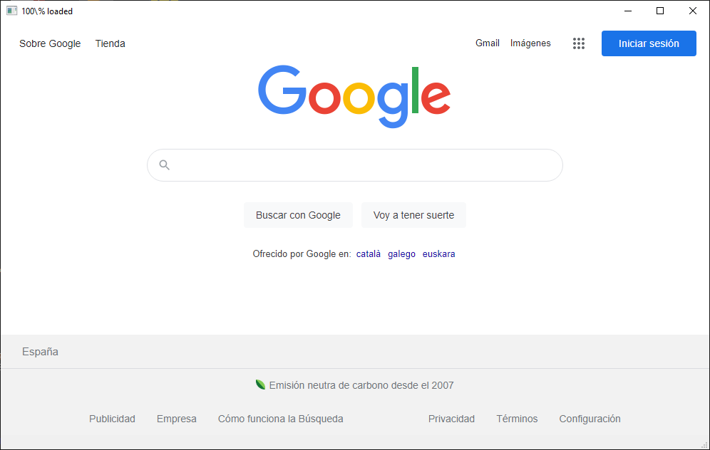

<div id="top"></div>

[![MIT License][license-shield]][license-url]
[![Issues][issues-shield]][issues-url]
[![Forks][forks-shield]][forks-url]
[![Contributors][contributors-shield]][contributors-url]
[![Stargazers][stars-shield]][stars-url]
[![LinkedIn][linkedin-shield]][linkedin-url]

<!-- PROJECT LOGO -->
<br />
<div align="center">
  <a href="https://github.com/paterbytes/gui-python">
    
  </a>

<h3 align="center">GUI-Python</h3>

  <p align="center">
    Python GUI from scratch, step-by-step.
    <br/>
    Executable file rendering html local files and browsing the web.
    <br />
    <br />
    <a href="https://github.com/paterbytes/gui-python/issues">Report Bug 🐞</a>
  </p>
</div>


<!-- TABLE OF CONTENTS -->
<details>
  <summary>:bookmark_tabs: Table of Contents</summary>
  <ol>
    <li>
      <a href="#about-the-project">About The Project</a>
      <ul>
        <li><a href="#built-with">Built With</a></li>
      </ul>
    </li>
    <li>
      <a href="#getting-started">Getting Started</a>
      <ul>
        <li><a href="#prerequisites">Prerequisites</a></li>
        <li><a href="#python-3100">Python 3.10.0</a></li>
        <li><a href="#pyqt-6-library">PyQt 6 Library</a></li>
        <li><a href="#pyqt6-webengine-library">PyQt 6 Web Engine Library</a></li>
        <li><a href="#eel-library">Eel Library</a></li>
      </ul>
    </li>
    <li><a href="#roadmap">Roadmap</a></li>
    <li><a href="#contributing">Contributing</a></li>
    <li><a href="#license">License</a></li>
    <li><a href="#contact">Contact</a></li>
  </ol>
</details>
<br/>


<!-- ABOUT THE PROJECT -->
## About The Project <span id="about-the-project"></span>

[![Product Name Screen Shot][product-screenshot]](https://example.com)

This project aims to create a Web broswer able to load embedded html files (with assets, imgs, css) and navigate the internet, all in one executable **.exe** file.

<p align="right">(<a href="#top">back to top</a>)</p>


## :wrench: Built With <span id="built-with"></span>
|Software| Version | Purpose
|---	|:---:	|---
|[Python](https://www.python.org/)|3.8.2| Interpretate and run the scripts
|[Qt](https://www.riverbankcomputing.com/software/pyqt/)|6| PyQt is a Python  [binding] of the cross-platform GUI toolkit Qt, implemented as a Python plug-in.
|[Tkinter](https://www.riverbankcomputing.com/software/pyqt/)|Built in Python| Tkinter is a Python [binding]  to the Tk GUI toolkit
|[Eel](https://github.com/ChrisKnott/Eel) | |Create excutable (.exe)

<p align="right">(<a href="#top">back to top</a>)</p>


<!-- GETTING STARTED -->
## :checkered_flag: Getting Started <span id="getting-started"></span>

This is an example of how you may give instructions on setting up your project locally.
To get a local copy up and running follow these simple example steps.

## Prerequisites <span id="prerequisites"></span>

Next steps will help you to configure your system be able to run, test and create executable for Python software.

## :large_blue_circle: Python 3.10.0 <span id="python-3100"></span>
Python is an interpreted, interactive, object-oriented programming language.
  * Go to [Python Download]
  * Scroll to **Files** and over the Python installer.

### Installation
1. After you download Python installer, open the file.
2. Follow the installation instructions.
3. Open the command line (CMD) and execute:
   ```sh
   python --version
   ```
4. If the installation was successful you will see this:
   ```sh
   Python 3.10.0
   ```


## :large_blue_circle: PyQt 6 library <span id="pyqt-6-library"></span>
PyQt is a set of Python bindings for The Qt Company's Qt application framework and runs on all platforms supported by Qt including Windows, macOS, Linux, iOS and Android.

It has a commercial version too: [Qt commercial version]

### Installation
Install PyQt6 from **pip**, open the command line (CMD) and execute:
  ```sh
  pip install PyQt6
  ```


## :large_blue_circle: PyQt6-WebEngine library <span id="pyqt6-webengine-library"></span>
PyQt-WebEngine is a set of Python bindings for The Qt Company's Qt WebEngine libraries. It is available for PyQt6 and PyQt6.

### Installation
Install PyQt6-WebEngine from **pip**, open the command line (CMD) and execute:
  ```sh
  pip install PyQt6-WebEngine
  ```

## :large_blue_circle: Eel library <span id="eel-library"></span>
Eel is a little Python library for making simple Electron-like offline HTML/JS GUI apps, with full access to Python capabilities and libraries.

### Installation
Install Eel from **pip**, open the command line (CMD) and execute:
  ```sh
  pip install Eel
  ```

**Note:** Another way to install all with **pip** is:
```sh
pip install PyQt6 PyQt6-WebEngine Eel
```

<p align="right">(<a href="#top">back to top</a>)</p>


<!-- ROADMAP -->
## :round_pushpin: Roadmap <span id="roadmap"></span>

- [01.Window]
  - [01.Qt-window.py] - Create a simple Qt window
  - [02.Qt-window.py] - Adding status bar and name
  - **03.Qt-window<span>.py** - Adding resizing and icon
  - **04.Qt-window<span>.py** - Adding navigation bar  
  - **03.Qt-window<span>.py** - Adding resizing and icon
  - **04.Qt-window<span>.py** - Adding navigation bar
  - [01.Tk-window.py] - Create a simple Tkinter window
  - [02.Tk-window.py] - Create a simple Tkinter window
  <br/>...
- XX.Executable - *TODO: Web broswer .exe*

See the [open issues](https://github.com/paterbytes/gui-python/issues) for a full list of proposed features (and known issues).

<p align="right">(<a href="#top">back to top</a>)</p>


<!-- CONTRIBUTING -->
## :construction: Contributing <span id="contributing"></span>

Contributions are what make the open source community such an amazing place to learn, inspire, and create. Any contributions you make are **greatly appreciated**.

If you have a suggestion that would make this better, please fork the repo and create a pull request. You can also simply open an issue with the tag "enhancement".
Don't forget to give the project a star! Thanks again!

1. Fork the Project
2. Create your Feature Branch (`git checkout -b feature/AmazingFeature`)
3. Commit your Changes (`git commit -m 'Add some AmazingFeature'`)
4. Push to the Branch (`git push origin feature/AmazingFeature`)
5. Open a Pull Request

<p align="right">(<a href="#top">back to top</a>)</p>


<!-- LICENSE -->
## :scroll: License <span id="license"></span>

Distributed under the MIT License. See `LICENSE.txt` for more information.

<p align="right">(<a href="#top">back to top</a>)</p>


<!-- CONTACT -->
## :card_index: Contact <span id="contact"></span>

Jose Luis Paternina - [PaterBytes](https://github.com/paterbytes) - josepaternina@gmail.com

Project Link: [https://github.com/paterbytes/gui-python](https://github.com/paterbytes/gui-python)
<br/><br/>
<hr/>

<p align="center">(<a href="#top">Back to top</a>)<br/>· · ·<br/></p>

<!-- MARKDOWN LINKS & IMAGES -->
<!-- https://www.markdownguide.org/basic-syntax/#reference-style-links -->
[Qt commercial version]:https://www.riverbankcomputing.com/commercial/license-faq
  
[Python Download]:https://www.python.org/downloads/
[contributors-shield]: https://img.shields.io/github/contributors/paterbytes/gui-python.svg?style=for-the-badge
[contributors-url]: https://github.com/paterbytes/gui-python/graphs/contributors
[forks-shield]: https://img.shields.io/github/forks/paterbytes/gui-python.svg?style=for-the-badge
[forks-url]: https://github.com/paterbytes/gui-python/network/members
[stars-shield]: https://img.shields.io/github/stars/paterbytes/gui-python.svg?style=for-the-badge
[stars-url]: https://github.com/paterbytes/gui-python/stargazers
[issues-shield]: https://img.shields.io/github/issues/paterbytes/gui-python.svg?style=for-the-badge
[issues-url]: https://github.com/paterbytes/gui-python/issues
[license-shield]: https://img.shields.io/github/license/paterbytes/gui-python.svg?style=for-the-badge
[license-url]: https://github.com/paterbytes/gui-python/blob/main/LICENSE.txt
[linkedin-shield]: https://img.shields.io/badge/-LinkedIn-black.svg?style=for-the-badge&logo=linkedin&colorB=555
[linkedin-url]: https://linkedin.com/in/paterninajose
[product-screenshot]: Images/expected-result.png
  
[01.Window]:https://github.com/paterbytes/gui-python/blob/main/01.Window
 
[01.Qt-window.py]:https://github.com/paterbytes/gui-python/blob/main/01.Window/01.Qt-window.py
[02.Qt-window.py]:https://github.com/paterbytes/gui-python/blob/main/01.Window/02.Qt-window.py
  
[01.Tk-window.py]:https://github.com/paterbytes/gui-python/blob/main/01.Window/01.Tk-window.py
[02.Tk-window.py]:https://github.com/paterbytes/gui-python/blob/main/01.Window/02.Tk-window.py

  
[binding]:(https://en.wikipedia.org/wiki/Language_binding)
